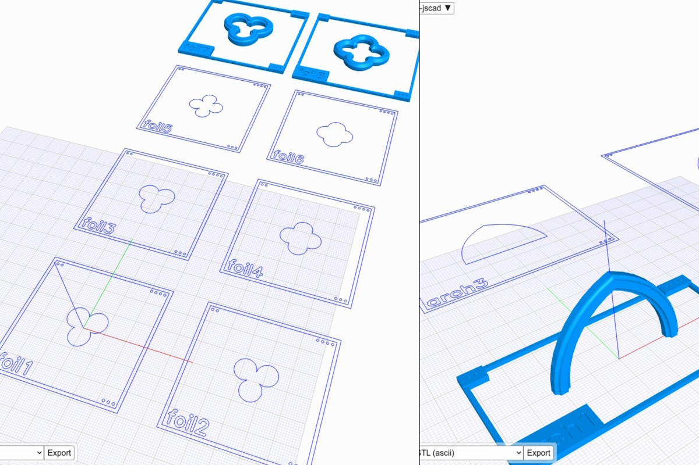
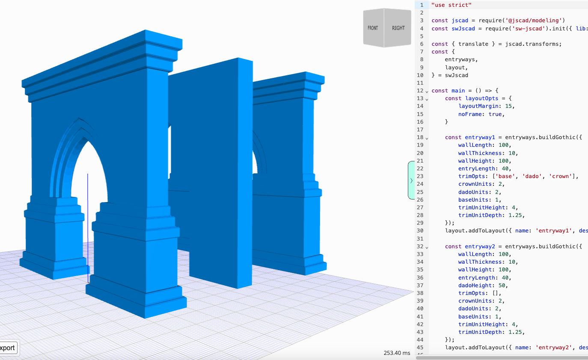
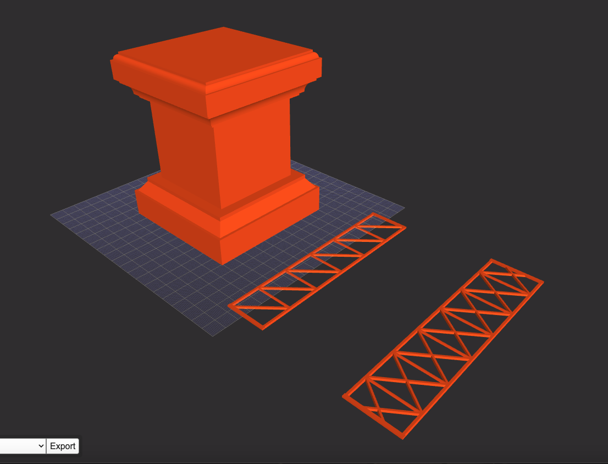
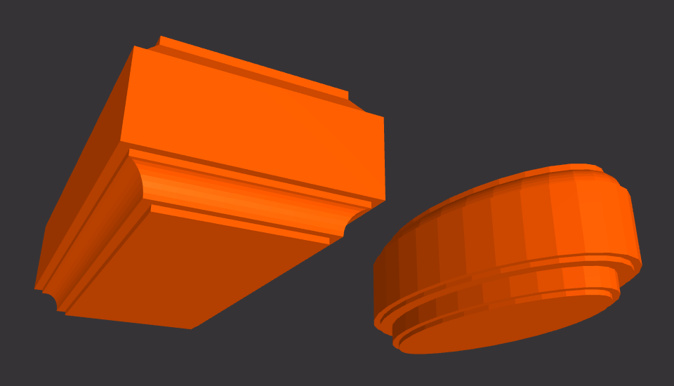
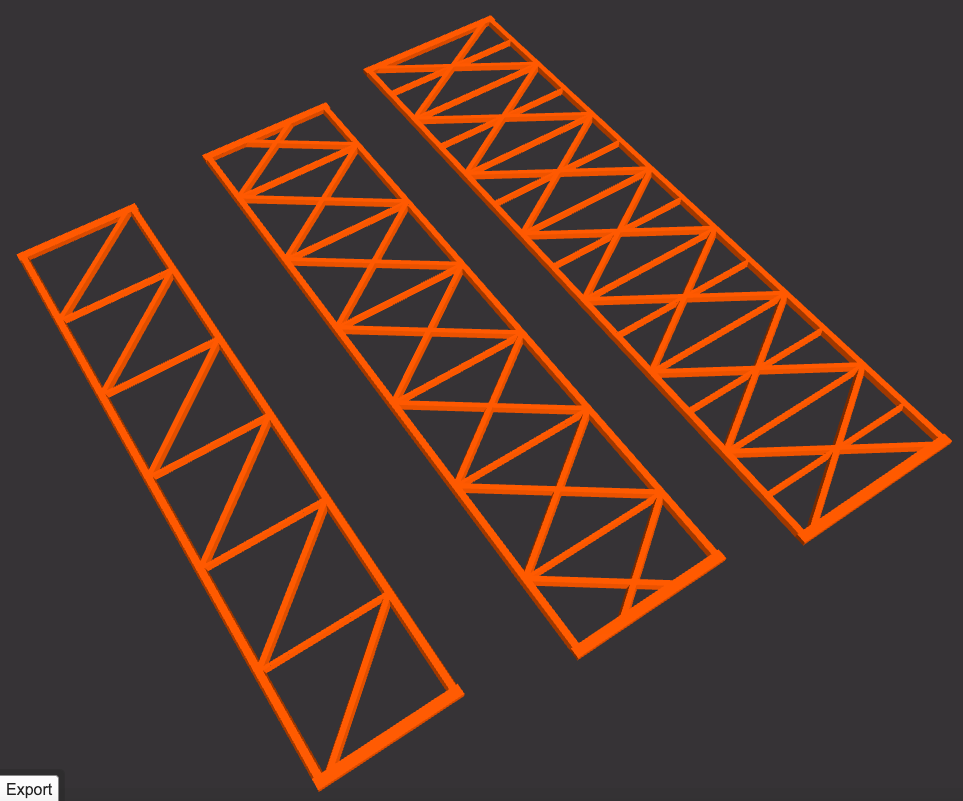

# swcad-js

Salvador Workshop's CAD coding tools (in JavaScript)

---



## Overview

### Online viewer

[sw-jscad-viewer.netlify.app/](https://sw-jscad-viewer.netlify.app/)  

A heavily customized version of the JSCAD UI ([https://github.com/hrgdavor/jscadui](https://github.com/hrgdavor/jscadui))

### API Docs  

[salvador-workshop.github.io/swcad-js/](https://salvador-workshop.github.io/swcad-js/)  

### Repository

[github.com/salvador-workshop/swcad-js/](https://github.com/salvador-workshop/swcad-js/)  

### NPM package

[npmjs.com/package/swcad-js](https://www.npmjs.com/package/swcad-js)  



## Usage

Works with JSCAD, however you consume it.

Try copying the example below into `sw-jscad-viewer` ([sw-jscad-viewer.netlify.app](https://sw-jscad-viewer.netlify.app)).  

```javascript
"use strict"

/* ----------------------------------------
 * Initialization
 * ------------------------------------- */

const jscad = require('@jscad/modeling')

const { cuboid } = jscad.primitives
const { translate } = jscad.transforms

const swcadJs = require('swcad-js').init({ jscad });
console.log('swcadJs', swcadJs)

const {
  math,
  transform,
} = swcadJs.calcs

const {
  colors,
} = swcadJs.utils

const {
  openWebJoist,
} = swcadJs.components

const {
  routedCuboid,
} = swcadJs.components.routedShapes


//==============================================================================


/* ----------------------------------------
 * Model / Scene Prep
 * ------------------------------------- */

// "INTRO" PLINTH

const introPlinthSize = [
  math.inchesToMm(4),
  math.inchesToMm(4),
  math.inchesToMm(5),
]

const endBlockSize = [
  introPlinthSize[0],
  introPlinthSize[1],
  introPlinthSize[2] / 4,
]

const midBlockOverhang = math.inchesToMm(5 / 8)

const midBlockSize = [
  introPlinthSize[0] - (midBlockOverhang * 2),
  introPlinthSize[1] - (midBlockOverhang * 2),
  introPlinthSize[2] / 2,
]

// Midsection is built with jscad
// Top and Bottom ends are built with swcad-js

const mid = cuboid({ size: midBlockSize })

const baseOpts = {
  size: endBlockSize,
  topBit: 'chamfer',
  topBitOpts: {
    radius1: 6,
    radius2: 8,
    offset1: 3,
    offset2: 2,
    offset3: 3,
    offset4: 2,
  },
  bottomBit: 'none',
  bottomBitOpts: {
    radius1: 6,
    radius2: 8,
    offset1: 3,
    offset2: 2,
    offset3: 3,
    offset4: 2,
  },
}

const baseData = routedCuboid(baseOpts)
const base = baseData[0]

const topOpts = {
  size: endBlockSize,
  topBit: 'roundOver',
  topBitOpts: {
    radius1: 3,
    radius2: 4,
    offset1: 1.5,
    offset2: 1.5,
  },
  bottomBit: 'cove',
  bottomBitOpts: {
    radius1: 6,
    radius2: 8,
    offset1: 2.5,
    offset2: 2.5,
    offset3: 2.5,
    offset4: 2.5,
  },
}

const topData = routedCuboid(topOpts)
const top = topData[0]

// The library also has helper functions

const introPlinth = transform.stack({}, [base, mid, top])

// OPEN WEB JOIST

const openWebJoistOpts1 = {
  length: math.inchesToMm(6),
  width: math.inchesToMm(1.25),
}

const openWebJoistOpts2 = {
  length: math.inchesToMm(6.5),
  width: math.inchesToMm(1.5),
  reinforcementLevel: 2
}

const openWebJoistData1 = openWebJoist(openWebJoistOpts1)
const openWebJoistData2 = openWebJoist(openWebJoistOpts2)

const openWebJoistModel1 = openWebJoistData1[0]
const openWebJoistModel2 = openWebJoistData2[0]


//==============================================================================


/* ----------------------------------------
 * Main function for JSCAD
 * ------------------------------------- */


function main() {
  const spaceUnit = math.inchesToMm(4)

  return [
    translate([spaceUnit * 0, spaceUnit * 0, spaceUnit * 0], introPlinth),
    translate([spaceUnit * 1, spaceUnit * 0, spaceUnit * 0], openWebJoistModel1),
    translate([spaceUnit * 2, spaceUnit * 0, spaceUnit * 0], openWebJoistModel2),
  ]
}

module.exports = { main }
```



## API

The `swcad-js` library's main functional divisions:

### `Data` — Static info

- Constants
- Specifications
- Standards

### `Calcs` — Calculations of all sorts

- Math
- Geometry
- Position
- Transform

### `Profiles` — 2D profiles, surfaces, sections

- Curve
- BeadsBits
- Edge
- Text
- Trim

STRUCTURE — More complex profiles

- Arch
- Foil
- Mesh

SHAPES — Basic shapes, and profiles built around them

- Triangle
- Circle
- Ellipse
- Square
- Rectangle
  - Frame
- Hexagon
- Octagon


### `ProfileSpec` — 2D profiles conforming to specs

- Lumber
- Paper

### `Components` — Basic reusable 3D units

- BeadsBits
- DowelFittings
- OpenWebJoist
- Mesh
- Moulding
- Text




### `ComponentSpec` — 3D components conforming to specs

- Tile
- Brick
- Crafts

### `Models` — Complex 3D models

- Arch
- Buttress
- Foil
- Column
- Roof
- Wall
  - Entryway

### `Utils` — Auxiliary utilities

- Colors
- Layout

## Structure



Internally, the library is split into several packages that follow the main API divisions:

`swcad-js-calcs` — Calculations of all sorts

`swcad-js-component-spec` — 3D components conforming to specs

`swcad-js-components` — Basic reusable 3D units

`swcad-js-core` — Integrates all these packages together into the final package

`swcad-js-data` — Static info

`swcad-js-models` — Complex 3D models

`swcad-js-profile-spec` — 2D profiles conforming to specs

`swcad-js-profiles` — 2D profiles, surfaces, sections

`swcad-js-utils` — Auxiliary utilities

